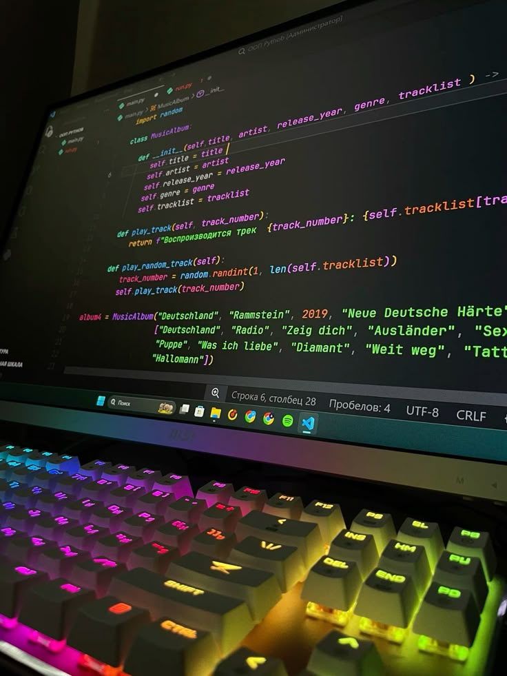

# CodeDestroyer-Portfolio

<div align="center">
  
  
  
  
</div>

<div align="center">
  
  
  
  
  
  
</div>

<br>

<p align="center">
  
</p>

## 📋 Обзор

Минималистичный, современный и футуристичный одностраничный веб-сайт портфолио, разработанный для демонстрации моих навыков программирования под псевдонимом "CodeDestroyer". Сайт представляет собой цифровую визитную карточку с неоновой футуристической эстетикой и плавными анимациями, которые подчеркивают мой технический опыт.

### ✨ Особенности

- **Минималистичный футуристический дизайн** с неоновыми акцентами и глитч-эффектами
- **Полностью отзывчивый макет** с приоритетом мобильных устройств
- **Динамическая загрузка контента** из конфигурационного файла JSON
- **Плавные анимации** и интерактивные эффекты
- **Легкий и оптимизированный** без тяжелых фреймворков
- **Интерактивный терминальный интерфейс** для демонстрации технической компетенции
- **Простота конфигурирования** и настройки

## 🚀 Быстрый старт

### Предварительные требования

- Веб-браузер (рекомендуется Chrome, Firefox или Edge последних версий)
- Базовые знания HTML, CSS и JavaScript для настройки

### Установка

1. Откройте файл `index.html` в вашем браузере или используйте локальный сервер:

```bash
# Используя Python
python -m http.server 8000

# Используя Node.js и npx
npx serve
```

2. Посетите `http://localhost:8000` в вашем браузере.

## 🎨 Дизайн и философия

Дизайн этого портфолио вдохновлен кибер-эстетикой и футуристическими интерфейсами из научно-фантастических произведений. Ключевыми принципами дизайна являются:

- **Минимализм с характером**: Чистый, сфокусированный дизайн, который подчеркивает контент, но с выразительными визуальными элементами
- **Акцент на типографике**: Использование технических и футуристических шрифтов для создания нужного настроения
- **Неоновый цветовой палитры**: Глубокие темные фоны с яркими неоновыми акцентами создают визуальный контраст
- **Интерактивность**: Тонкие микровзаимодействия, которые повышают вовлеченность пользователя
- **Скорость и производительность**: Оптимизированная кодовая база для быстрой загрузки

## ⚙️ Настройка

### Настройка содержимого

Все данные портфолио хранятся в файле `config/data.json`. Вы можете легко обновить всю информацию, отредактировав этот файл:

```json
{
  "name": "CodeDestroyer",
  "tagline": "Превращаю сложные задачи в элегантный код",
  "about": "Опытный full-stack разработчик...",
  "skills": [
    {
      "category": "Frontend",
      "techs": ["JavaScript", "React", "Vue", "TypeScript", "HTML5", "CSS3", "Tailwind"]
    }
  ],
  "github": "https://github.com/CodeDestroyer",
  "contact": {
    "email": "contact@codedestroyer.dev",
    "linkedin": "https://linkedin.com/in/codedestroyer",
    "twitter": "https://twitter.com/CodeDestroyer"
  }
}
```

### Кастомизация внешнего вида

Для настройки внешнего вида и стиля вы можете отредактировать CSS-переменные в файле `css/styles.css`:

```css
:root {
  --neon-cyan: #00f0ff;
  --neon-purple: #a83bff;
  --neon-magenta: #ff2cf7;
  --dark-bg: #050505;
  --glow-spread: 5px;
}
```

## 🚀 Деплой

### GitHub Pages

1. Если вы используете GitHub, вы можете легко развернуть сайт с помощью GitHub Pages:

```bash
git add .
git commit -m "Готово к деплою"
git push origin main
```

2. Перейдите в настройки репозитория на GitHub, активируйте GitHub Pages и выберите ветку `main` в качестве источника.

### Другие варианты размещения

Портфолио можно разместить на любом веб-хостинге, который поддерживает статические сайты, включая:

- Netlify
- Vercel
- Firebase Hosting
- Amazon S3 + CloudFront

## 🛠️ Технологии

- **HTML5** - Структура и семантическая разметка
- **CSS3 и Tailwind CSS** - Стилизация и отзывчивый дизайн
- **Vanilla JavaScript** - Интерактивность и динамический контент
- **JSON** - Хранение и конфигурация данных

## 📄 Лицензия

Этот проект распространяется под лицензией MIT - подробности смотрите в файле LICENSE.

## 📬 Контакт

CodeDestroyer - [@CodeX_developer](https://t.me/CodeX_developer) - vadimkapro0123@gmail.com

URL проекта: [https://github.com/vadimx-stack/CodeDestroyer-Portfolio](https://github.com/vadimx-stack/CodeDestroyer-Portfolio)

---

<div align="center">
  <sub>Разработано с ♥︎ CodeDestroyer</sub>
</div> 